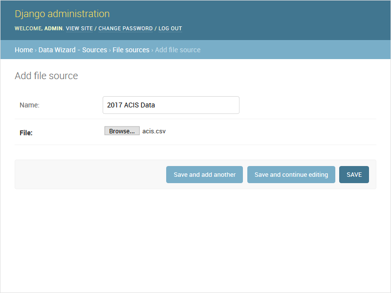

# Django Admin Integration

Django Data wizard is designed to integrate seamlessly with the Django Admin UI, particurlarly when `data_wizard.sources` is listed in `INSTALLED_APPS`.  The following [models] provided by the wizard are registered with the Admin API by default:

### FileSource & URLSource Admin

If you use a custom source model instead of `data_wizard.sources`, be sure to register it with the admin as described in [sources documentation][sources].

### Identifier Admin

Django Data Wizard identifier mappings can be viewed and edited via the Django Admin.

### Run Admin

Runs can also be viewed through the admin - though the [Run List][list] view will generally be more useful.

[models]: ../config/models.md
[sources]: ../config/sources.md
[list]: ./list.md

