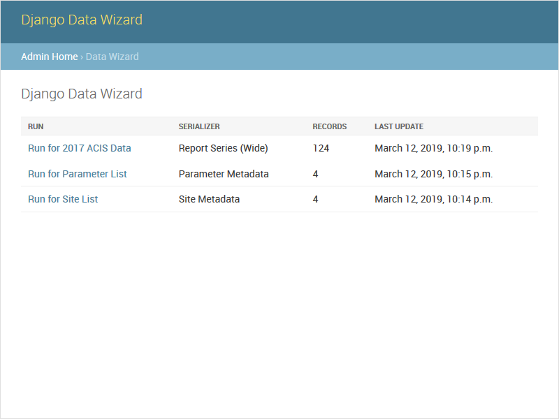

# Run List

#### `GET /datawizard/`

Django Data Wizard provides a list view that summarises prior runs and the number of records imported by each.  Incomplete runs can also be restarted from this list.
