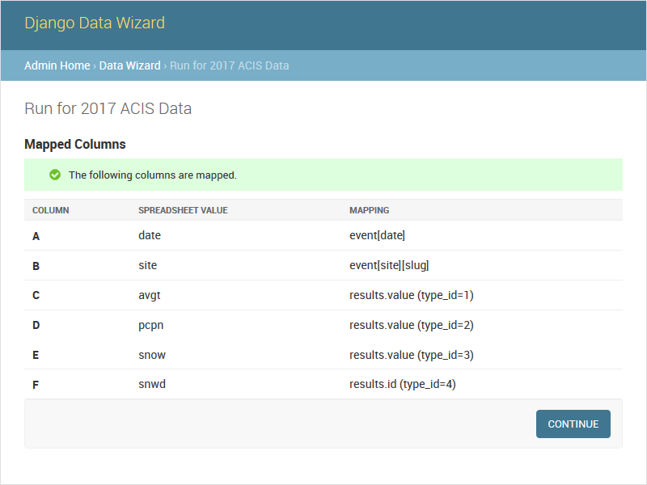

# Columns Selected

     
#### `POST /datawizard/[id]/updatecolumns`

The `updatecolumns` task saves the specified mappings from source data columns to target serializer fields.  This is typically called from the form generated by the [`columns`][columns] task, and will redirect to that task when complete.

parameter     | description
--------------|----------------------------------------
`rel_[relid]` | The column to map to the specified serializer field.  The `relid` and the complete list of possible mappings will be provided by the `columns` task.

> Source: [`data_wizard.tasks.update_columns`](https://github.com/wq/django-data-wizard/blob/main/data_wizard/tasks.py#L459)

[columns]: ./columns.md
