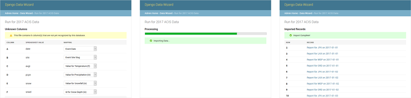

**Django Data Wizard** is an interactive tool for mapping tabular data (e.g. Excel, CSV, XML, JSON) into a normalized database structure via [Django REST Framework](https://www.django-rest-framework.org/) and [IterTable](./itertable/index.md).  Django Data Wizard allows novice users to map spreadsheet columns to serializer fields (and cell values to foreign keys) on-the-fly during the import process.  This reduces the need for preset spreadsheet formats, which most data import solutions require.

[**Django Data Wizard on GitHub**](https://github.com/wq/django-data-wizard)

## News

> Django Data Wizard 2.0 was released on June 23, 2022!
>
> [Install](./overview/setup.md) • [View Release Notes](./releases/django-data-wizard-2.0.0.md)

## Documentation
